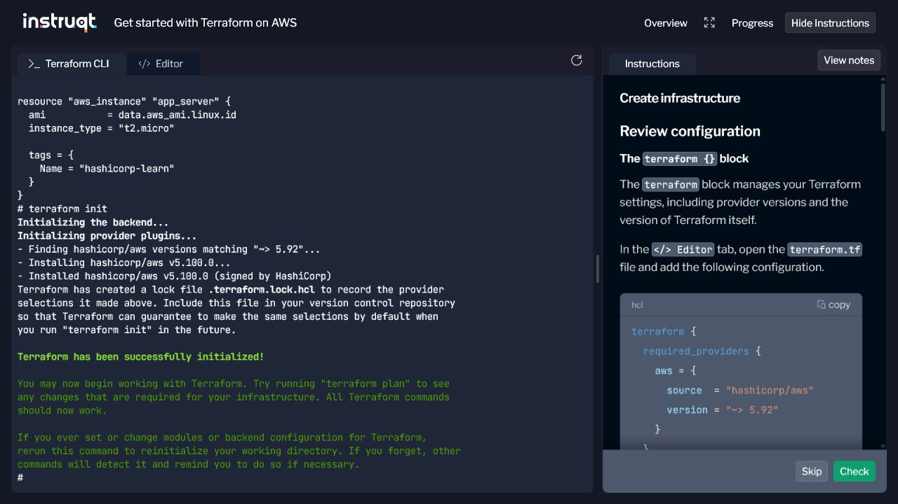
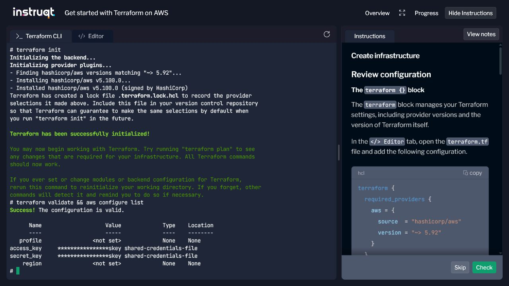
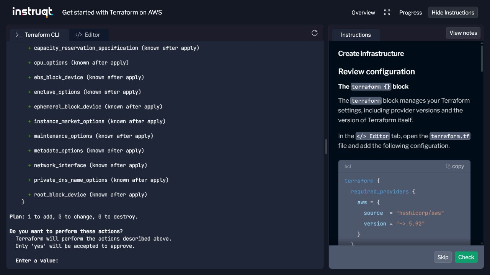
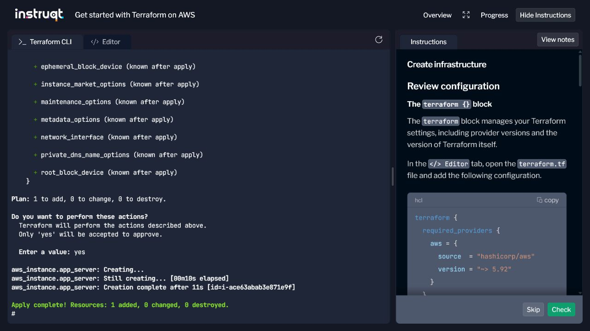
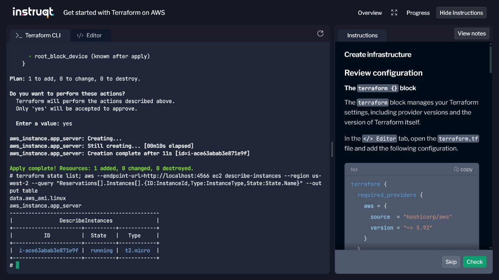
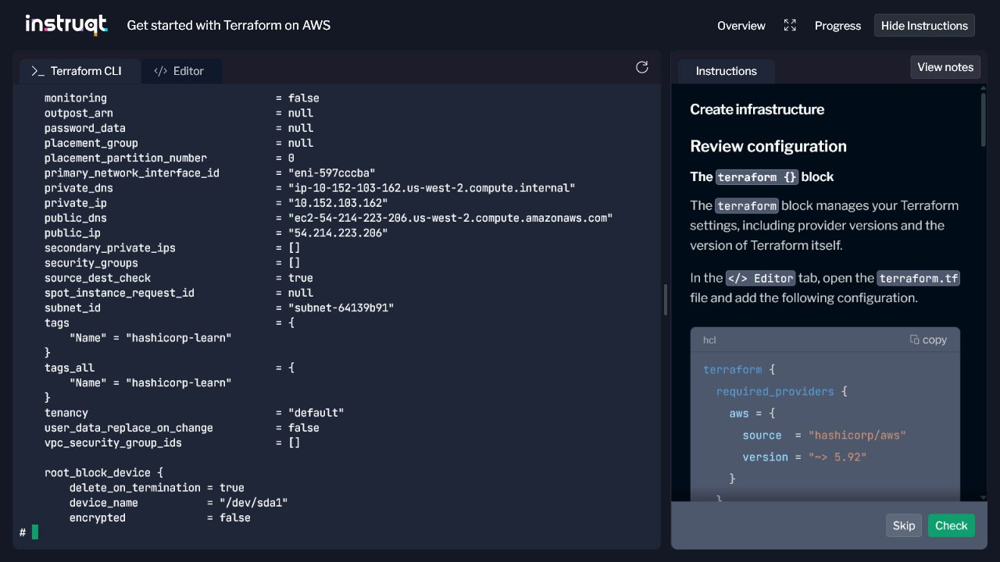
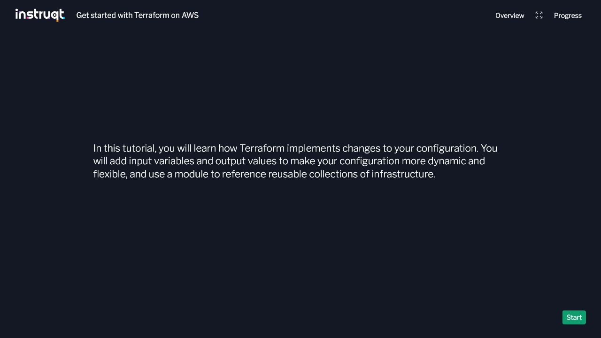

# Infraestrutura como Código com Terraform

Atividade baseada no tutorial oficial [Create infrastructure](https://developer.hashicorp.com/terraform/tutorials/aws-get-started/aws-create), da HashiCorp. O objetivo é utilizar Terraform para declarar e provisionar uma instância EC2 como Infraestrutura como Código (IaC).

## Estrutura do repositório

| Arquivo | Finalidade |
| --- | --- |
| `terraform.tf` | Define as versões mínimas do Terraform e do provider AWS. |
| `main.tf` | Configura o LocalStack, consulta uma AMI e declara a instância EC2. |
| `.terraform.lock.hcl` | Fixa a versão e os hashes do provider instalado. |
| `.gitignore` | Impede o versionamento de estado, planos, variáveis e arquivos locais. |
| `docs/images/` | Armazena as evidências obtidas durante a execução. |

## Passo a passo executado

### 1. Acesso ao laboratório

1. Acessei o [tutorial da HashiCorp](https://developer.hashicorp.com/terraform/tutorials/aws-get-started/aws-create).
2. Na seção **Interactive terminal**, selecionei **Start interactive lab**.
3. Selecionei **Launch** e, em seguida, **Start**.

O ambiente abriu um terminal Linux temporário com Terraform, AWS CLI, Docker e credenciais de laboratório já configurados.

### 2. Configuração do Terraform

O arquivo `terraform.tf` define o provider AWS:

```hcl
terraform {
  required_providers {
    aws = {
      source  = "hashicorp/aws"
      version = "~> 5.92"
    }
  }

  required_version = ">= 1.2"
}
```

O arquivo `main.tf` possui três blocos principais:

- `provider "aws"`: conecta o provider ao endpoint EC2 do LocalStack.
- `data "aws_ami" "linux"`: consulta a AMI Amazon Linux mais recente disponível no simulador.
- `resource "aws_instance" "app_server"`: cria uma instância `t2.micro` com a tag `Name = "hashicorp-learn"`.

As credenciais presentes em `main.tf` são fictícias e servem apenas para o LocalStack. Elas não dão acesso a nenhuma conta AWS.

### 3. Formatação

```bash
terraform fmt
```

O comando padroniza a indentação e a organização dos arquivos `.tf`.

### 4. Inicialização

```bash
terraform init
```

O Terraform inicializou o diretório e instalou o provider `hashicorp/aws` v5.100.0, compatível com a restrição `~> 5.92`.



### 5. Validação e credenciais

```bash
terraform validate
aws configure list
```

O primeiro comando confirmou que a configuração era válida. O segundo mostrou que o laboratório possuía credenciais temporárias, exibidas de forma mascarada.



### 6. Plano de execução

```bash
terraform apply
```

Antes de realizar qualquer alteração, o Terraform exibiu o plano: `1 to add, 0 to change, 0 to destroy`. A criação foi confirmada digitando `yes`.



### 7. Criação da infraestrutura

Após a confirmação, a instância foi criada com sucesso. O resultado foi `Resources: 1 added, 0 changed, 0 destroyed`.



### 8. Inspeção do estado e do recurso

```bash
terraform state list

aws --endpoint-url=http://localhost:4566 ec2 describe-instances \
  --region us-west-2 \
  --query "Reservations[].Instances[].{ID:InstanceId,Type:InstanceType,State:State.Name}" \
  --output table
```

O estado do Terraform registrou a fonte de dados da AMI e a instância. A consulta pela AWS CLI confirmou a instância `t2.micro` no estado `running`.



Também foi executado:

```bash
terraform show
```

O comando exibiu os atributos armazenados no estado, como IPs simulados, subnet, tipo da instância e tag.



### 9. Conclusão do desafio

Após selecionar **Check**, o laboratório aceitou a etapa e avançou para o tutorial seguinte, **Manage infrastructure**.



## Itens provisionados

| Item | Identificação no Terraform | Resultado da execução |
| --- | --- | --- |
| Consulta de AMI Amazon Linux | `data.aws_ami.linux` | AMI localizada no LocalStack e registrada no estado. |
| Instância EC2 simulada | `aws_instance.app_server` | ID `i-ace63abab3e871e9f` |
| Tipo da instância | `instance_type` | `t2.micro` |
| Estado | AWS CLI/LocalStack | `running` |
| Região simulada | Provider AWS | `us-west-2` |
| Tag | `Name` | `hashicorp-learn` |

Os identificadores, endereços IP e nomes DNS apresentados pelo LocalStack são dados simulados e podem mudar a cada nova sessão.

## Problema encontrado no sandbox

Na execução de **14 de junho de 2026**, a imagem `latest` pré-carregada do LocalStack encerrou com erro de licença e deixou a porta `4566` indisponível. O diagnóstico foi feito com:

```bash
curl -sS http://localhost:4566/_localstack/health
docker ps -a
docker logs localstack
```

Para concluir a atividade, foi iniciada uma versão comunitária compatível:

```bash
docker pull localstack/localstack:3.8.1
docker rm -f localstack 2>/dev/null || true
docker run -d --name localstack -p 4566:4566 localstack/localstack:3.8.1
curl -sS http://localhost:4566/_localstack/health
```

Depois que o endpoint retornou o status dos serviços, `terraform apply` foi executado novamente e concluiu o provisionamento. Esse procedimento é apenas uma solução de contingência; se a porta `4566` já estiver respondendo, ele não é necessário.

## Limpeza do ambiente

Em uma execução local ou conta AWS, a remoção deve ser feita com:

```bash
terraform destroy
```

No laboratório interativo, o ambiente é temporário e foi reinicializado quando a atividade avançou para o desafio seguinte. O estado da etapa anterior deixou de estar disponível. Em uma conta AWS real, nunca se deve depender desse comportamento: é necessário executar `terraform destroy` e confirmar a remoção dos recursos.


## Referências

- [Tutorial Create infrastructure - HashiCorp](https://developer.hashicorp.com/terraform/tutorials/aws-get-started/aws-create)
- [Documentação do provider AWS](https://registry.terraform.io/providers/hashicorp/aws/latest/docs)
- [Documentação do LocalStack](https://docs.localstack.cloud/)
